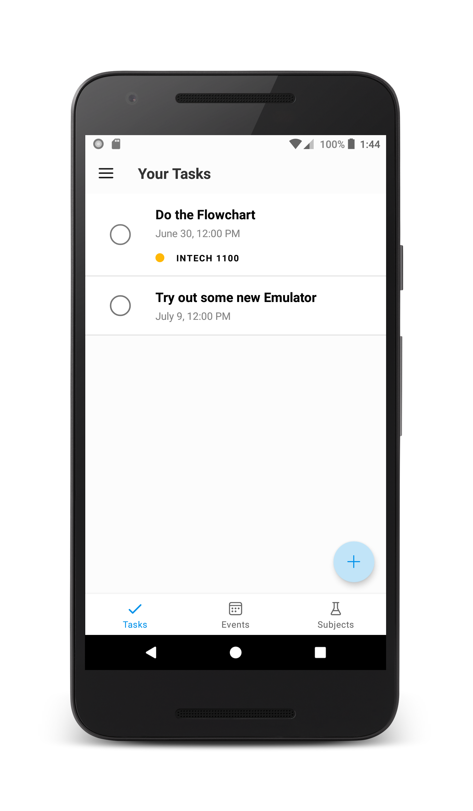
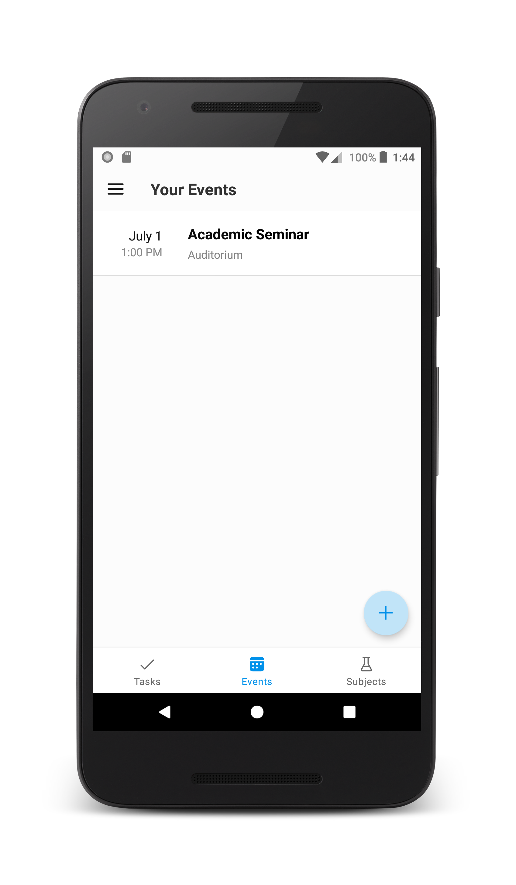
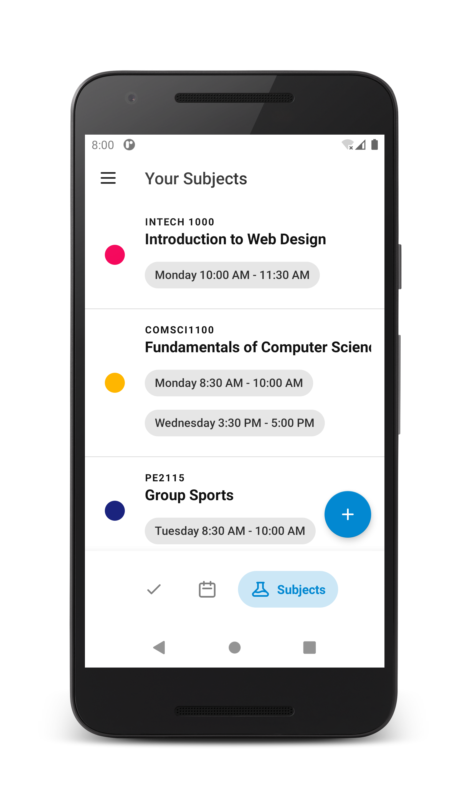

# Fokus - To Do app tailored specifically for students

Fokus is an open source application that combines a todo list and a calendar that can help you manage your school related work and events in one place. It's fast and beautiful yet simple design that can help you focus on what matters most.

## Features
* Get reminded when a task is nearing its due
* Get reminded about incoming events
* Add attachments to your tasks
* Persistent notifications for important tasks or events
* No ads or any tracking
* Open Source Code
* On-Device Database

## Screenshots

## Translations
* English
* German
* French
* Polish

## Built with
* Kotlin
* Room
* AndroidX
* Other cool open-source libraries (see Acknowledgements)

## Versioning
We use [SemVer](http://www.semver.org) for versioning. For the versions available, see the [tags on this repository](https://github.com/isaiahcollins02/fokus/tags)

## Licenses
This project is licensed under the AGPL-3.0 - see the license file for more details

## Contributing
This is an open-source personal project and I am very happy to accept community contributions. Open a PR to get started.

## Acknowledgements

### Libraries used
* [Material Dialogs](https://github.com/afollestad/material-dialogs) - Aidan Follestad
* [joda-time-android](https://github.com/dlew/joda-time-android) - Daniel Lew
* [Doki](https://github.com/doubledotlabs/doki) - Double Dot Labs
* [Konfetti](https://github.com/DanielMartinus/Konfetti) - Daniel Martinus
* [ExpandableBottomBar](https://github.com/st235/ExpandableBottomBar) - Alexander Dadukin

### Other materials used
* [Launcher Icon](https://flaticon.com/authors/freepik) - Freepik via Flaticon
* [Notification Sound](https://www.zapsplat.com/music/ui-alert-prompt-warm-wooden-mallet-style-notification-tone-generic-11/) - Zapsplat
* [Vector Illustrations](https://www.undraw.co) - UnDraw.co
